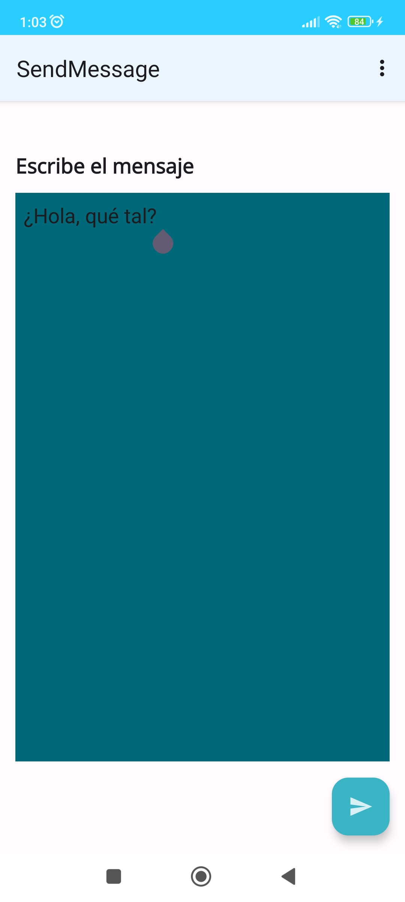
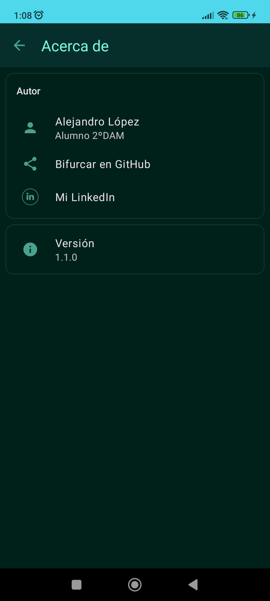

# SendMessageViewBinding

 Autor: **Alejandro López**
 Versión: **1.0**

## Objetivo 
El objetivo principal de este proyecto es realizar una aplicación de Android que permite a un usuario enviar un mensaje de manera sencilla y se muestre en otra interfaz el emisor, el receptor y el contenido del mensaje.

## Contenido aprendido.
- Diseño de interfaces para tener una visualización atractiva para el usuario, en este caso utilizamos tanto constraintLayout y LinearLayout para organizar y posicionar los elementos.
- Navegación entre Activities y comunicación enviando datos entre ellos usando Intent. 
- Acceder a los componentes de la interfaz a través del binding.
- Creación de un Activity llamado AboutActivity en el que muestra la información del autor y te envía un enlace web si lo seleccionas.
- Integración del repositorio material-about-library para lograr un aspecto más moderno del about, con él incluimos Cards para mostrar información de forma estructurada.

- Implementamos:
  - Funcionalidad de envío de mensajes a tiempo real.
  - Un menú con opciones para acceder al AboutActivity.
  -	Soporte a varios idiomas, con versiones en inglés y en español.
  - Distintos estilos personalizados en la aplicación, tanto de color, tamaño o fuente de texto importado.
  -	Temas personalizados en el about incluido modo Oscuro.
  -	El modo “landscape” usando otra interfaz.
 
- En otras cosas que aprendí:
  - Conocer y seguimiento del ciclo vida de los Activities viéndolos los registros Logcat.
  - Utilizar el modo debug, en el que hacemos la depuración del proyecto para hacer un seguimiento de la aplicación e identificar los problemas que pueden surgir.
  - Ampliar los conocimientos de la arquitectura MVVM de una aplicación Android.

# Capturas

## Icono:

## SendMessageActivity

|Configuración Español | Configuración Inglés| Modo Landscape| 
| ------------------------------ | ------------------------------ | ------------------------------ | 
|  | |    |

#### Barra de Menú de SendMessageActivity

## ViewActivity

## AboutActivity

| Modo Diurno                    | Modo Oscuro                  |
| ------------------------------ | ------------------------------ | 
|  |  |

