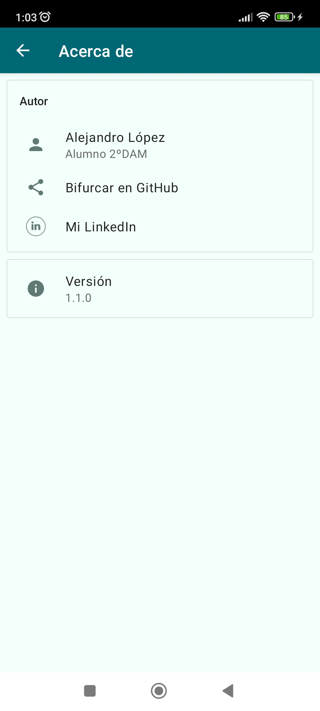

# SendMessageViewBinding

 Autor: **Alejandro López**
 Versión: **1.1.0**

## Objetivo 
El objetivo principal de este proyecto es realizar una aplicación de Android que permite a un usuario enviar un mensaje de manera sencilla y se muestre en otra interfaz el emisor y el contenido del mensaje.
También se debe añadir un "Acerca de" y mostrar una página web si lo seleccionas.

## Contenido aprendido.
- Diseño de interfaces para tener una visualización atractiva para el usuario, en este caso utilizamos tanto constraintLayout y LinearLayout para organizar y posicionar los elementos.
- Navegación entre Activities.
- Manejo de Intent tanto implícito como explícito.
- Utilización del bundle para enviar datos de clave y valor.
- Acceder a los componentes de la interfaz a través del binding.
- Creación del "Acerca de" en el que muestra información del autor y te envía a enlaces web utilizando intent implícitos.
- Integración del repositorio material-about-library para lograr un aspecto más moderno del about, con él incluimos Cards para mostrar información de forma estructurada.
- Definir los recursos en los XML para una mejor léctura y limpieza del código .

- Implementamos:
  - Funcionalidad de envío de mensajes a tiempo real.
  - Un menú con opción para acceder al "Acerca de".
  -	Soporte a varios idiomas, con versiones en inglés y en español.
  - Distintos estilos personalizados en la aplicación, tanto de color, tamaño o fuente de texto importado.
  -	Temas personalizados en el about incluido modo Oscuro.
  -	El modo “landscape” usando otra interfaz.
 
- En otras cosas que aprendí:
  - Conocer y seguimiento del ciclo vida de los Activities, utilizando los registros Logcat.
  - Utilizar el modo debug, en el que hacemos la depuración del proyecto para hacer un seguimiento de la aplicación e identificar los problemas que puedan surgir.
  - Ampliar los conocimientos de la arquitectura MVVM de una aplicación Android.

# Capturas

## Icono:

## SendMessageActivity

|Modo portrait|  Modo Landscape| 
| ------------------------------ | ------------------------------ | 
|  | |

#### Barra de Menú de SendMessageActivity

## ViewActivity

## AboutActivity

| Modo Diurno                    | Modo Oscuro                  |
| ------------------------------ | ------------------------------ | 
|  |  |

## Configuración en inglés

|SendMessageActivity Modo Portrait|SendMessageActivity Modo Landscape| AboutActivity| 
| ------------------------------ | ------------------------------ | ------------------------------ | 
|  | |    |

